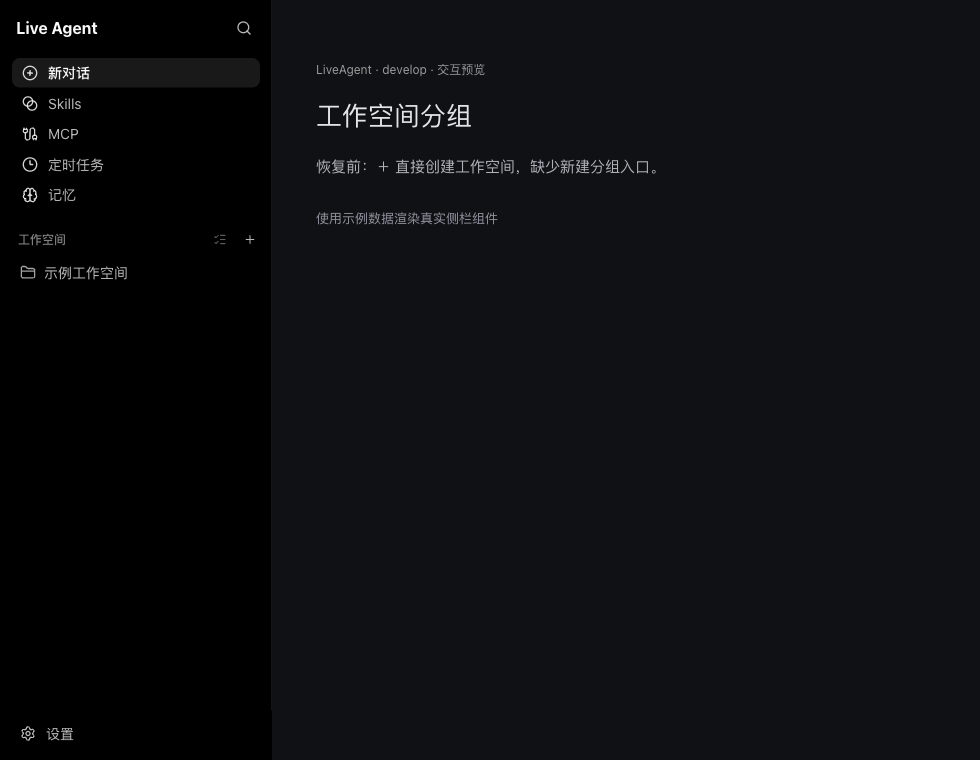
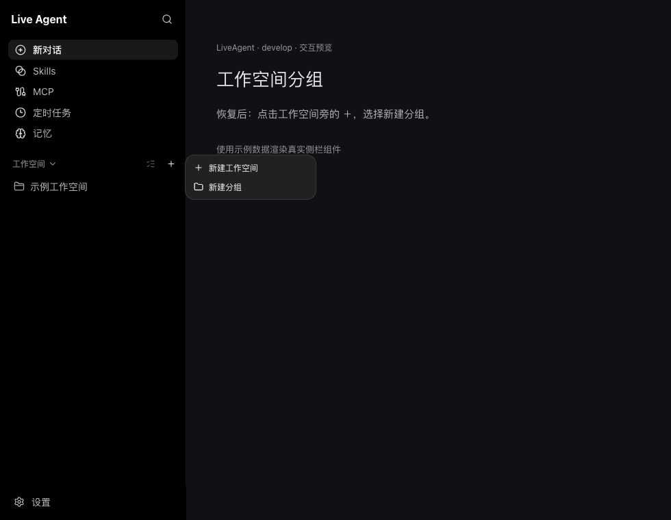
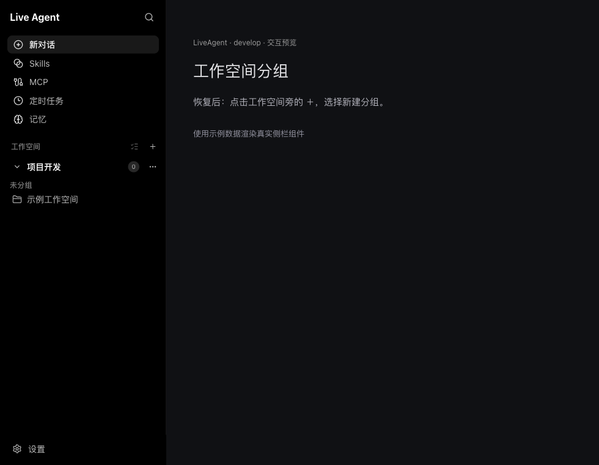

# 工作空间分组

左侧「工作空间」标题旁的 **＋** 菜单同时提供「新建工作空间」与「新建分组」。桌面端与 WebUI 使用同一个侧栏组件。

## 新建分组

1. 点击 **＋ → 新建分组**，焦点自动进入分组名称输入框。
2. 输入名称，按 Enter、点击确认或将焦点移出输入框即可保存。名称两端空白会被去除，空名称不创建分组。
3. 按 Escape 或点击取消会放弃创建。中文输入法选字时的 Enter 不会提前提交。

从折叠的工作空间区域开始创建时，会先展开区域；列表有隐藏项目时会显示完整列表，确保新分组可见。创建的分组初始为空，可通过工作空间的操作菜单将项目移入分组。

## 实现与验证

- 共享侧栏：`crates/agent-ui/src/components/chat/ChatHistorySidebar.tsx`。
- 复用 `onCreateWorkspaceGroup` 及桌面端 / WebUI 已有设置更新逻辑，数据仍保存在 `system.workspaceProjectGroups`，无需迁移。
- 沿用 `SidebarGroup` / `SidebarGroupContent`、侧栏菜单和名称输入样式。
- 回归测试覆盖菜单入口、输入焦点、确认与取消、空名称、中文输入法、禁用状态，以及空列表和截断列表中新分组的可见性。

## 界面预览

以下截图使用示例数据渲染真实共享侧栏组件；不包含账户数据。预览中的创建回调使用内存状态，不代表后端持久化验收。

恢复前，＋ 直接新建工作空间：

恢复后的添加菜单：

输入中文名称并按 Enter 创建空分组：

